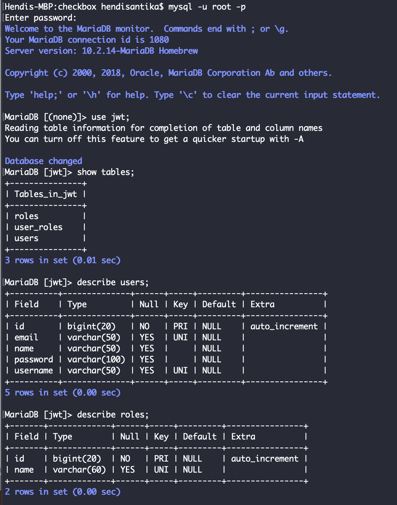
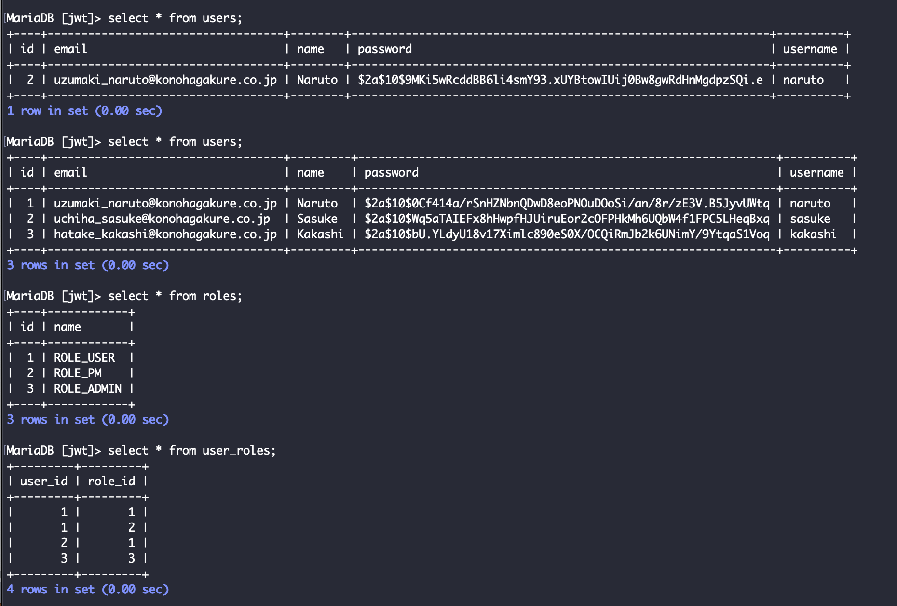
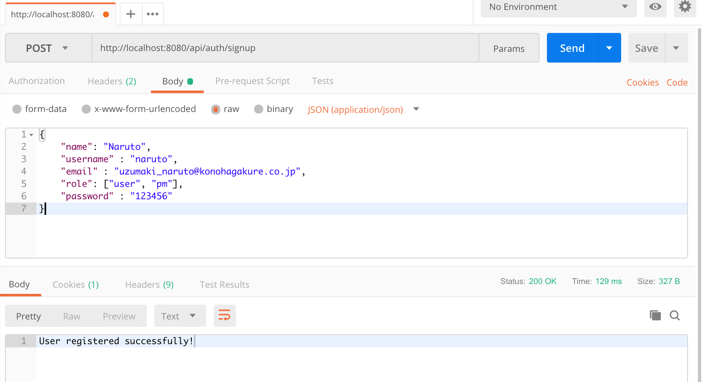
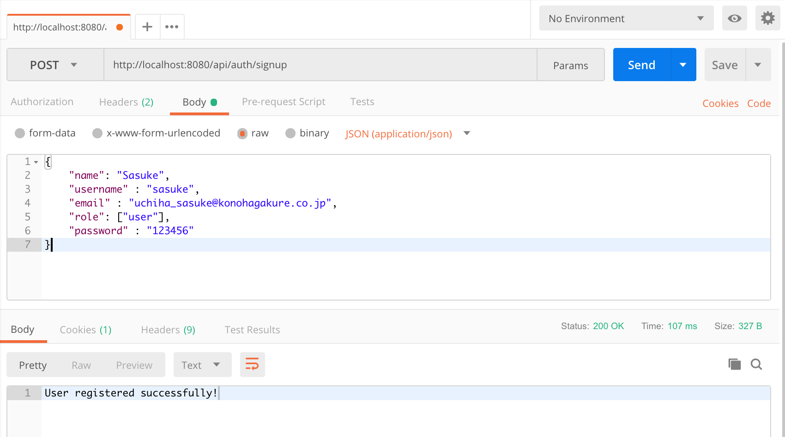
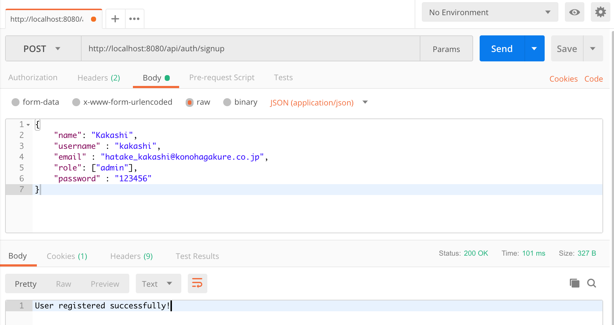

# spring-boot-jwt-authentication

Run this project by this command :

`mvn clean spring-boot:run`

Check database tables ->



– Insert data to roles table ->
```
INSERT INTO roles(name) VALUES('ROLE_USER');
INSERT INTO roles(name) VALUES('ROLE_PM');
INSERT INTO roles(name) VALUES('ROLE_ADMIN');
```



SignUp

Sign-Up 3 users:

* Naruto has ROLE_PM & ROLE_USER role
* Sasuke has ROLE_USER roles
* Kakashi has ROLE_ADMIN role

Naruto as User & PM



Sasuke as User



Kakashi as Admin

